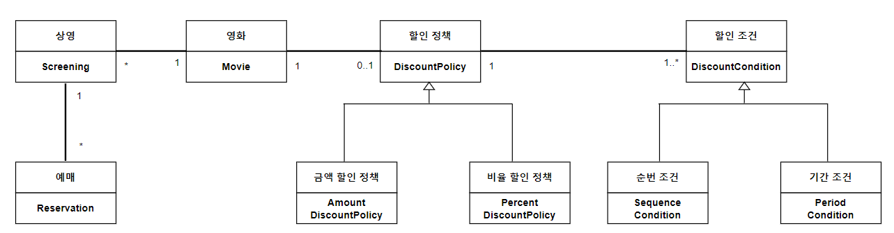

# 2. 객체지향 프로그래밍

# 1. 영화 예매 시스템

### 용어

    영화 - 영화에 대한 기본정보 (제목, 상영시간, 가격 정보 등..) 

    상영 - 시레로 관객들이 영화를 관람하는 사건을 표현 (상영 일자, 시간, 순번 등..)

### 요구사항

#### **할인 조건** (Discount Cond-)    
- 순서 조건 (Sequence Cond-) - **상영 순번**을 이용해 할인 여부를 결정
- 기간 조건 (Period Cond-) - 영화 **상영 시작 시간**을 이용해 할인 여부 결정
#### **할인 정책**(Discount Policy)
- 금액 할인 정책 (Amount Discount Policy) - 예매 요금에서 **일정 금액** 할인
- 비율 할인 정책 (Percent Discount Policy) - 예매 요금에서 **일정 비율**의 요금 할인 

# 2. 객체지향 프로그래밍을 향해

## 협력, 객체, 클래스

객체지향은 **클래스(class)가 아닌, 객체에 초첨**을 맞춰야 한다.

이를 위해 두가지에 집중해야 한다.

### 1. 어떤 클래스가 필요한지를 고민하기 전에 어떤 객체들이 필요한지 고민하라
   
   붕어빵으로 비유를 했을 때 
   - 클래스 - 붕어빵을 만들 수 있는 **틀**
   - 객체 - 틀에서 찍혀 나온 **붕어빵**
   
   객체(붕어빵)이 어떤 상태와 행동을 가지는지를 먼저 결정하면,    
   클래스(붕어빵 틀)이 윤곽을 잡기 쉽고, 설계를 단순하고 깔끔하게 만들 수 있다.

### 2. 객체를 독립적인 존재가 아니라 기능을 구현하기 위해 혐력하는 공동체의 일원으로봐야 한다.
유연하고 확장 가능한 설계를 위해서 객체가 독립적인 존재여서는 안된다.    
왜?

## 도메인의 구조를 따르는 프로그램 구조
### 도메인 (domain)
문제를 해결하기 위해 사용자가 프로그램을 사용하는 분야를 **도메인**이라고 부른다.   
이 프로그램에서의 문제는 **사용자가 영화를 좀 더 쉽고 빠르게 예매할 수 있는 시스템을 만드는 것**이다.

문제를 파악하고, 해결하기 위해 그려진 도메인에 따라 아래의 원칙에 맞춰 클래스를 만들자.    
**원칙 - 일반적으로 클래스의 이름은 대응되는 도메인 개념의 이름과 동일하거나, 적어도 유사하게 지어야 한다.**

아래 이미지는 영화 예매 도메인 구조에 맞게 만들어진 클래스 정보를 보여준다.    

## 클래스 구현하기

우리는 보통 클래스를 작성할 때 인스턴스 변수 - private, 메서드 - public으로 해서 외부에서 객체의 속성에 직접 접근하지 못하고, 객체의 속성은 public 메서드를 통해서만 변경할 수 있게 만든다.    

**클래스의 내부와 외부를 구분해야 하는 이유**
- 경계의 명확성이 객체의 자율성을 보장한다. (자율적인 객체)
- 프로그래머에게 구현의 자유를 제공한다. (프로그래머의 자유)

### 자율적인 객체
- 객체는 **상태(state)**와 **행동(behavior)**을 함께 가지는 복합적인 존재다.
- 객체는 스스로 판단하고 행동하는 **자율적인 존재**이다.

   
